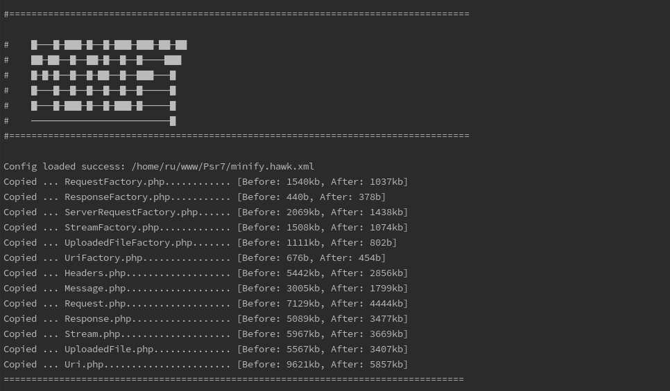

# Minify

[](LICENSE.md)
[](https://github.com/hawkphp/minify/releases)


Minify code a before deployment 



## Quickstart

Installation:

```
    "require-dev": {
        "hawkphp/minify": "^1.1.0"
    }
```

Example config file: minify.hawk.xml
```
<?xml version="1.0"?>
<config name="Minify">
    <description>Minify code</description>
    <pathFrom>src</pathFrom>
    <pathTo>deploy</pathTo>
    <extensions>
        <ext>php</ext>
        <ext>js</ext>
        <ext>css</ext>
    </extensions>
</config>
```

* `pathFrom` - the path to your project folder.
* `pathTo` - the path to the <deploy> folder.
* `extensions` - types of files to be minify

## Add to your composer:
```
  "scripts": {
    "deploy": [
      "@minify"
    ],
    "minify": "-all"
  }
```

After you can make a deploy:

```bash
$ composer deploy
```


## Tests

You can execute the test suite. You'll need to clone the repository and install the dependencies.

```bash
$ git clone https://github.com/hawkphp/minify
$ composer install
$ composer test
```


## Contributing
Please, if you find errors, write to me about it. You can also do pull request.

## Pull Requests
1. Fork this repository
2. Create a new branch for each feature 
3. Send a pull request from each feature branch
